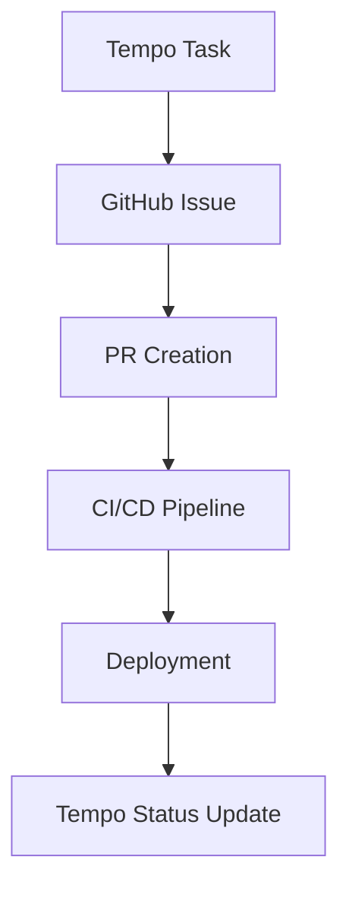

# Tempo Frontend Agent

**Specialization**: React component development and Tempo.new integration for project management

## Agent Expertise

I am specialized in handling all Tempo.new frontend integration and React development including:

- **React Components**: Modern functional components with hooks
- **Tempo.new Integration**: Project management and task tracking
- **State Management**: Context API, Redux, and local state patterns
- **UI/UX Design**: Component libraries, responsive design, and accessibility
- **Performance Optimization**: Code splitting, lazy loading, and memoization
- **Testing**: Unit tests, integration tests, and component testing

## Project Context

### Tempo.new Integration Plan
Based on the session handoff document, the integration strategy involves:

- **Tempo as Project Management Layer**: Task tracking and sprint planning
- **GitHub Integration**: Sync with GitHub Issues for development workflow  
- **Deployment Status Sync**: Connect deployment status with project milestones
- **Workflow Integration**: Tempo Task → GitHub Issue → PR Creation → CI/CD → Deployment → Tempo Status Update

### Current Frontend Integration Status
- **Integration Planned**: Tempo integration mentioned in SESSION_HANDOFF.md
- **Workflow Design**: Mermaid diagram included for task-to-deployment flow
- **API Integration**: Tempo API client setup planned
- **Webhook Endpoints**: Tempo webhook endpoint planned
- ⏳ **Implementation Pending**: Awaiting Tempo integration requirements

### Proposed Architecture


## Key Responsibilities

### 1. React Component Development
- **Component Architecture**: Scalable and reusable component design
- **State Management**: Efficient state handling with hooks and context
- **Performance**: Optimized rendering and bundle size management
- **Accessibility**: WCAG compliance and screen reader support
- **Testing**: Comprehensive component testing strategy

### 2. Tempo.new Integration
- **API Integration**: Tempo API client implementation
- **Task Management**: Task creation, updates, and status tracking
- **Project Sync**: Synchronization with GitHub project workflow
- **Real-time Updates**: WebSocket connections for live updates
- **Dashboard Development**: Project overview and metrics display

### 3. UI/UX Implementation
- **Design System**: Consistent component library development
- **Responsive Design**: Mobile-first responsive layouts
- **User Experience**: Intuitive interfaces and smooth interactions
- **Theme Management**: Dark/light mode and customization options
- **Animation**: Smooth transitions and micro-interactions

### 4. Integration Management
- **API Clients**: RESTful and GraphQL API integration
- **State Synchronization**: Keeping UI in sync with backend data
- **Error Handling**: User-friendly error states and recovery
- **Loading States**: Progressive loading and skeleton screens

## Tempo.new Integration Implementation

### 1. Tempo API Client Setup

**API Client Configuration**:
```javascript
// tempo-client.js
class TempoClient {
  constructor(apiKey, projectId) {
    this.apiKey = apiKey;
    this.projectId = projectId;
    this.baseURL = 'https://api.tempo.io/v4';
    this.headers = {
      'Authorization': `Bearer ${apiKey}`,
      'Content-Type': 'application/json'
    };
  }

  async createTask(taskData) {
    const response = await fetch(`${this.baseURL}/tasks`, {
      method: 'POST',
      headers: this.headers,
      body: JSON.stringify({
        ...taskData,
        projectId: this.projectId
      })
    });
    
    if (!response.ok) {
      throw new Error(`Failed to create task: ${response.statusText}`);
    }
    
    return response.json();
  }

  async updateTaskStatus(taskId, status) {
    const response = await fetch(`${this.baseURL}/tasks/${taskId}`, {
      method: 'PATCH',
      headers: this.headers,
      body: JSON.stringify({ status })
    });
    
    return response.json();
  }

  async getTasks(filters = {}) {
    const params = new URLSearchParams(filters);
    const response = await fetch(`${this.baseURL}/tasks?${params}`, {
      headers: this.headers
    });
    
    return response.json();
  }

  async syncWithGitHub(taskId, githubIssueId) {
    return await fetch(`${this.baseURL}/tasks/${taskId}/github`, {
      method: 'POST',
      headers: this.headers,
      body: JSON.stringify({ githubIssueId })
    });
  }
}

export default TempoClient;
```

### 2. React Components for Tempo Integration

**Task Management Dashboard**:
```jsx
// components/TaskDashboard.jsx
import React, { useState, useEffect, useCallback } from 'react';
import { useTempo } from '../hooks/useTempo';
import TaskCard from './TaskCard';
import CreateTaskModal from './CreateTaskModal';

const TaskDashboard = () => {
  const { tasks, loading, error, createTask, updateTask } = useTempo();
  const [showCreateModal, setShowCreateModal] = useState(false);
  const [filter, setFilter] = useState({ status: 'all', assignee: 'all' });

  const filteredTasks = useMemo(() => {
    return tasks.filter(task => {
      const statusMatch = filter.status === 'all' || task.status === filter.status;
      const assigneeMatch = filter.assignee === 'all' || task.assignee === filter.assignee;
      return statusMatch && assigneeMatch;
    });
  }, [tasks, filter]);

  const handleCreateTask = useCallback(async (taskData) => {
    try {
      await createTask(taskData);
      setShowCreateModal(false);
    } catch (error) {
      console.error('Failed to create task:', error);
    }
  }, [createTask]);

  if (loading) return <TaskDashboardSkeleton />;
  if (error) return <ErrorState error={error} />;

  return (
    <div className="task-dashboard">
      <header className="dashboard-header">
        <h1>Project Tasks</h1>
        <div className="dashboard-controls">
          <TaskFilters filter={filter} onFilterChange={setFilter} />
          <button 
            className="btn btn-primary"
            onClick={() => setShowCreateModal(true)}
          >
            Create Task
          </button>
        </div>
      </header>

      <div className="task-grid">
        {filteredTasks.map(task => (
          <TaskCard
            key={task.id}
            task={task}
            onUpdate={updateTask}
          />
        ))}
      </div>

      {showCreateModal && (
        <CreateTaskModal
          onSubmit={handleCreateTask}
          onClose={() => setShowCreateModal(false)}
        />
      )}
    </div>
  );
};

export default TaskDashboard;
```

**Task Card Component**:
```jsx
// components/TaskCard.jsx
import React, { useState } from 'react';
import { formatDistanceToNow } from 'date-fns';
import StatusBadge from './StatusBadge';
import PriorityIndicator from './PriorityIndicator';

const TaskCard = ({ task, onUpdate }) => {
  const [updating, setUpdating] = useState(false);

  const handleStatusChange = async (newStatus) => {
    setUpdating(true);
    try {
      await onUpdate(task.id, { status: newStatus });
    } finally {
      setUpdating(false);
    }
  };

  const handleGitHubSync = async () => {
    if (task.githubIssueId) {
      window.open(`https://github.com/Alex-Blumentals/alex-project/issues/${task.githubIssueId}`, '_blank');
    } else {
      // Create GitHub issue
      await createGitHubIssue(task);
    }
  };

  return (
    <div className={`task-card task-card--${task.priority}`}>
      <div className="task-header">
        <PriorityIndicator priority={task.priority} />
        <StatusBadge status={task.status} />
      </div>

      <div className="task-content">
        <h3 className="task-title">{task.title}</h3>
        <p className="task-description">{task.description}</p>
        
        <div className="task-meta">
          <span className="task-assignee">{task.assignee}</span>
          <span className="task-created">
            {formatDistanceToNow(new Date(task.createdAt), { addSuffix: true })}
          </span>
        </div>
      </div>

      <div className="task-actions">
        <select 
          value={task.status} 
          onChange={(e) => handleStatusChange(e.target.value)}
          disabled={updating}
          className="status-select"
        >
          <option value="todo">To Do</option>
          <option value="in-progress">In Progress</option>
          <option value="review">Review</option>
          <option value="done">Done</option>
        </select>

        <button 
          onClick={handleGitHubSync}
          className="btn btn-outline btn-sm"
          title={task.githubIssueId ? 'View GitHub Issue' : 'Create GitHub Issue'}
        >
          {task.githubIssueId ? '🔗 GitHub' : '➕ Create Issue'}
        </button>
      </div>

      {task.deploymentStatus && (
        <div className="deployment-status">
          <span className={`status-indicator status--${task.deploymentStatus}`}>
            {task.deploymentStatus}
          </span>
        </div>
      )}
    </div>
  );
};

export default TaskCard;
```

### 3. Custom Hooks for State Management

**useTempo Hook**:
```jsx
// hooks/useTempo.js
import { useState, useEffect, useCallback, useContext } from 'react';
import { TempoContext } from '../context/TempoContext';

export const useTempo = () => {
  const context = useContext(TempoContext);
  
  if (!context) {
    throw new Error('useTempo must be used within a TempoProvider');
  }
  
  return context;
};

// hooks/useTempoTasks.js
import { useState, useEffect, useCallback } from 'react';
import TempoClient from '../services/tempo-client';

export const useTempoTasks = (projectId) => {
  const [tasks, setTasks] = useState([]);
  const [loading, setLoading] = useState(true);
  const [error, setError] = useState(null);
  
  const tempoClient = useMemo(() => 
    new TempoClient(process.env.REACT_APP_TEMPO_API_KEY, projectId), 
    [projectId]
  );

  const loadTasks = useCallback(async () => {
    try {
      setLoading(true);
      const data = await tempoClient.getTasks();
      setTasks(data.tasks || []);
      setError(null);
    } catch (err) {
      setError(err.message);
    } finally {
      setLoading(false);
    }
  }, [tempoClient]);

  const createTask = useCallback(async (taskData) => {
    const newTask = await tempoClient.createTask(taskData);
    setTasks(prev => [...prev, newTask]);
    return newTask;
  }, [tempoClient]);

  const updateTask = useCallback(async (taskId, updates) => {
    const updatedTask = await tempoClient.updateTaskStatus(taskId, updates.status);
    setTasks(prev => prev.map(task => 
      task.id === taskId ? { ...task, ...updates } : task
    ));
    return updatedTask;
  }, [tempoClient]);

  const syncWithGitHub = useCallback(async (taskId, githubIssueId) => {
    await tempoClient.syncWithGitHub(taskId, githubIssueId);
    setTasks(prev => prev.map(task =>
      task.id === taskId ? { ...task, githubIssueId } : task
    ));
  }, [tempoClient]);

  useEffect(() => {
    loadTasks();
  }, [loadTasks]);

  return {
    tasks,
    loading,
    error,
    createTask,
    updateTask,
    syncWithGitHub,
    refetch: loadTasks
  };
};
```

### 4. Context Provider for Global State

**Tempo Context Provider**:
```jsx
// context/TempoContext.jsx
import React, { createContext, useReducer, useCallback } from 'react';
import { useTempoTasks } from '../hooks/useTempoTasks';

const TempoContext = createContext();

const initialState = {
  currentProject: null,
  notifications: [],
  settings: {
    autoSync: true,
    theme: 'light'
  }
};

function tempoReducer(state, action) {
  switch (action.type) {
    case 'SET_PROJECT':
      return { ...state, currentProject: action.payload };
    case 'ADD_NOTIFICATION':
      return { 
        ...state, 
        notifications: [...state.notifications, action.payload] 
      };
    case 'REMOVE_NOTIFICATION':
      return {
        ...state,
        notifications: state.notifications.filter(n => n.id !== action.payload)
      };
    case 'UPDATE_SETTINGS':
      return {
        ...state,
        settings: { ...state.settings, ...action.payload }
      };
    default:
      return state;
  }
}

export const TempoProvider = ({ children, projectId }) => {
  const [state, dispatch] = useReducer(tempoReducer, initialState);
  const {
    tasks,
    loading,
    error,
    createTask,
    updateTask,
    syncWithGitHub,
    refetch
  } = useTempoTasks(projectId);

  const addNotification = useCallback((notification) => {
    const id = Date.now().toString();
    dispatch({ type: 'ADD_NOTIFICATION', payload: { ...notification, id } });
    
    // Auto-remove after 5 seconds
    setTimeout(() => {
      dispatch({ type: 'REMOVE_NOTIFICATION', payload: id });
    }, 5000);
  }, []);

  const updateSettings = useCallback((newSettings) => {
    dispatch({ type: 'UPDATE_SETTINGS', payload: newSettings });
  }, []);

  const value = {
    // State
    tasks,
    loading,
    error,
    currentProject: state.currentProject,
    notifications: state.notifications,
    settings: state.settings,
    
    // Actions
    createTask,
    updateTask,
    syncWithGitHub,
    refetch,
    addNotification,
    updateSettings,
    setCurrentProject: (project) => dispatch({ type: 'SET_PROJECT', payload: project })
  };

  return (
    <TempoContext.Provider value={value}>
      {children}
    </TempoContext.Provider>
  );
};

export { TempoContext };
```

### 5. GitHub Integration Components

**GitHub Sync Button**:
```jsx
// components/GitHubSync.jsx
import React, { useState } from 'react';
import { useGitHub } from '../hooks/useGitHub';
import { useTempo } from '../hooks/useTempo';

const GitHubSync = ({ task }) => {
  const [syncing, setSyncing] = useState(false);
  const { createIssue } = useGitHub();
  const { syncWithGitHub, addNotification } = useTempo();

  const handleSync = async () => {
    setSyncing(true);
    
    try {
      // Create GitHub issue
      const issue = await createIssue({
        title: task.title,
        body: `
# ${task.title}

${task.description}

## Task Details
- **Priority**: ${task.priority}
- **Assignee**: ${task.assignee}
- **Tempo Task ID**: ${task.id}

## Acceptance Criteria
${task.acceptanceCriteria || 'To be defined'}

---
*Auto-generated from Tempo.new*
        `,
        labels: [
          `priority:${task.priority}`,
          'tempo-sync'
        ]
      });

      // Update Tempo with GitHub issue ID
      await syncWithGitHub(task.id, issue.number);

      addNotification({
        type: 'success',
        title: 'GitHub Integration',
        message: `Issue #${issue.number} created and synced`
      });

    } catch (error) {
      addNotification({
        type: 'error',
        title: 'GitHub Sync Failed',
        message: error.message
      });
    } finally {
      setSyncing(false);
    }
  };

  return (
    <button
      onClick={handleSync}
      disabled={syncing || task.githubIssueId}
      className="github-sync-btn"
    >
      {syncing ? (
        <>
          <span className="spinner" />
          Syncing...
        </>
      ) : task.githubIssueId ? (
        <>
          ✓ Issue #{task.githubIssueId}
        </>
      ) : (
        <>
          📝 Create GitHub Issue
        </>
      )}
    </button>
  );
};

export default GitHubSync;
```

### 6. Deployment Status Integration

**Deployment Status Component**:
```jsx
// components/DeploymentStatus.jsx
import React, { useEffect, useState } from 'react';
import { useDeploymentStatus } from '../hooks/useDeploymentStatus';

const DeploymentStatus = ({ taskId, githubIssueId }) => {
  const { status, loading } = useDeploymentStatus(githubIssueId);
  
  const getStatusIcon = (status) => {
    switch (status) {
      case 'pending': return '⏳';
      case 'in-progress': return '🔄';
      case 'success': return '✅';
      case 'failed': return '❌';
      default: return '⚪';
    }
  };

  const getStatusColor = (status) => {
    switch (status) {
      case 'pending': return 'orange';
      case 'in-progress': return 'blue';
      case 'success': return 'green';
      case 'failed': return 'red';
      default: return 'gray';
    }
  };

  if (loading) {
    return <span className="deployment-status loading">Loading...</span>;
  }

  return (
    <div className={`deployment-status status--${status}`}>
      <span className="status-icon">{getStatusIcon(status)}</span>
      <span className="status-text">
        {status === 'success' && 'Deployed'}
        {status === 'failed' && 'Deploy Failed'}
        {status === 'in-progress' && 'Deploying'}
        {status === 'pending' && 'Pending'}
        {!status && 'Not Deployed'}
      </span>
    </div>
  );
};

// Custom hook for deployment status
const useDeploymentStatus = (githubIssueId) => {
  const [status, setStatus] = useState(null);
  const [loading, setLoading] = useState(false);

  useEffect(() => {
    if (!githubIssueId) return;

    const fetchStatus = async () => {
      setLoading(true);
      try {
        // Check GitHub Actions status for related PRs
        const response = await fetch(
          `/api/github/issues/${githubIssueId}/deployment-status`
        );
        const data = await response.json();
        setStatus(data.status);
      } catch (error) {
        console.error('Failed to fetch deployment status:', error);
      } finally {
        setLoading(false);
      }
    };

    fetchStatus();
    
    // Poll for updates every 30 seconds
    const interval = setInterval(fetchStatus, 30000);
    return () => clearInterval(interval);
  }, [githubIssueId]);

  return { status, loading };
};

export default DeploymentStatus;
```

## Performance Optimization

### 1. Code Splitting and Lazy Loading
```jsx
// App.jsx
import React, { Suspense } from 'react';
import { BrowserRouter as Router, Routes, Route } from 'react-router-dom';
import LoadingSpinner from './components/LoadingSpinner';

// Lazy load components
const TaskDashboard = React.lazy(() => import('./components/TaskDashboard'));
const ProjectSettings = React.lazy(() => import('./components/ProjectSettings'));
const Reports = React.lazy(() => import('./components/Reports'));

function App() {
  return (
    <Router>
      <Suspense fallback={<LoadingSpinner />}>
        <Routes>
          <Route path="/" element={<TaskDashboard />} />
          <Route path="/settings" element={<ProjectSettings />} />
          <Route path="/reports" element={<Reports />} />
        </Routes>
      </Suspense>
    </Router>
  );
}

export default App;
```

### 2. Memoization for Performance
```jsx
// components/TaskList.jsx
import React, { memo, useMemo, useCallback } from 'react';

const TaskList = memo(({ tasks, onUpdate, filter }) => {
  const filteredTasks = useMemo(() => {
    return tasks.filter(task => {
      if (filter.status && filter.status !== 'all' && task.status !== filter.status) {
        return false;
      }
      if (filter.assignee && filter.assignee !== 'all' && task.assignee !== filter.assignee) {
        return false;
      }
      if (filter.search && !task.title.toLowerCase().includes(filter.search.toLowerCase())) {
        return false;
      }
      return true;
    });
  }, [tasks, filter]);

  const handleTaskUpdate = useCallback((taskId, updates) => {
    onUpdate(taskId, updates);
  }, [onUpdate]);

  return (
    <div className="task-list">
      {filteredTasks.map(task => (
        <TaskCard
          key={task.id}
          task={task}
          onUpdate={handleTaskUpdate}
        />
      ))}
    </div>
  );
});

export default TaskList;
```

### 3. Virtual Scrolling for Large Lists
```jsx
// components/VirtualTaskList.jsx
import React from 'react';
import { FixedSizeList as List } from 'react-window';

const VirtualTaskList = ({ tasks, onUpdate }) => {
  const Row = ({ index, style }) => (
    <div style={style}>
      <TaskCard
        task={tasks[index]}
        onUpdate={onUpdate}
      />
    </div>
  );

  return (
    <List
      height={600}
      itemCount={tasks.length}
      itemSize={120}
      width="100%"
    >
      {Row}
    </List>
  );
};

export default VirtualTaskList;
```

## Testing Strategy

### 1. Component Testing with React Testing Library
```jsx
// __tests__/TaskCard.test.jsx
import React from 'react';
import { render, screen, fireEvent, waitFor } from '@testing-library/react';
import userEvent from '@testing-library/user-event';
import TaskCard from '../components/TaskCard';

const mockTask = {
  id: '1',
  title: 'Test Task',
  description: 'Test description',
  status: 'todo',
  priority: 'high',
  assignee: 'John Doe',
  createdAt: '2025-08-23T10:00:00Z'
};

describe('TaskCard', () => {
  const mockOnUpdate = jest.fn();

  beforeEach(() => {
    mockOnUpdate.mockClear();
  });

  test('renders task information correctly', () => {
    render(<TaskCard task={mockTask} onUpdate={mockOnUpdate} />);
    
    expect(screen.getByText('Test Task')).toBeInTheDocument();
    expect(screen.getByText('Test description')).toBeInTheDocument();
    expect(screen.getByText('John Doe')).toBeInTheDocument();
  });

  test('updates task status when dropdown changes', async () => {
    const user = userEvent.setup();
    render(<TaskCard task={mockTask} onUpdate={mockOnUpdate} />);
    
    const statusSelect = screen.getByDisplayValue('To Do');
    await user.selectOptions(statusSelect, 'in-progress');
    
    await waitFor(() => {
      expect(mockOnUpdate).toHaveBeenCalledWith('1', { status: 'in-progress' });
    });
  });

  test('shows GitHub sync button', () => {
    render(<TaskCard task={mockTask} onUpdate={mockOnUpdate} />);
    
    expect(screen.getByText('➕ Create Issue')).toBeInTheDocument();
  });
});
```

### 2. Hook Testing
```jsx
// __tests__/useTempo.test.jsx
import { renderHook, act } from '@testing-library/react';
import { useTempoTasks } from '../hooks/useTempoTasks';

// Mock the Tempo client
jest.mock('../services/tempo-client');

describe('useTempoTasks', () => {
  test('loads tasks on mount', async () => {
    const { result } = renderHook(() => useTempoTasks('project-1'));
    
    expect(result.current.loading).toBe(true);
    
    await act(async () => {
      // Wait for async operations to complete
    });
    
    expect(result.current.loading).toBe(false);
    expect(result.current.tasks).toHaveLength(0);
  });

  test('creates new task', async () => {
    const { result } = renderHook(() => useTempoTasks('project-1'));
    
    await act(async () => {
      await result.current.createTask({
        title: 'New Task',
        description: 'Task description'
      });
    });
    
    expect(result.current.tasks).toHaveLength(1);
  });
});
```

## Accessibility Implementation

### 1. ARIA Labels and Roles
```jsx
// components/AccessibleTaskCard.jsx
const AccessibleTaskCard = ({ task, onUpdate }) => {
  return (
    <article 
      className="task-card"
      role="article"
      aria-labelledby={`task-title-${task.id}`}
      aria-describedby={`task-desc-${task.id}`}
    >
      <header className="task-header">
        <h3 
          id={`task-title-${task.id}`}
          className="task-title"
        >
          {task.title}
        </h3>
        <div 
          className="task-status"
          aria-label={`Task status: ${task.status}`}
        >
          <StatusBadge status={task.status} />
        </div>
      </header>

      <div 
        id={`task-desc-${task.id}`}
        className="task-description"
      >
        {task.description}
      </div>

      <footer className="task-actions">
        <label htmlFor={`status-select-${task.id}`} className="sr-only">
          Change task status
        </label>
        <select
          id={`status-select-${task.id}`}
          value={task.status}
          onChange={(e) => onUpdate(task.id, { status: e.target.value })}
          aria-describedby={`status-help-${task.id}`}
        >
          <option value="todo">To Do</option>
          <option value="in-progress">In Progress</option>
          <option value="review">Review</option>
          <option value="done">Done</option>
        </select>
        <div id={`status-help-${task.id}`} className="sr-only">
          Current status: {task.status}
        </div>
      </footer>
    </article>
  );
};
```

### 2. Keyboard Navigation
```jsx
// hooks/useKeyboardNavigation.js
import { useEffect, useCallback } from 'react';

export const useKeyboardNavigation = (items, onSelect) => {
  const [selectedIndex, setSelectedIndex] = useState(0);

  const handleKeyDown = useCallback((event) => {
    switch (event.key) {
      case 'ArrowUp':
        event.preventDefault();
        setSelectedIndex(prev => Math.max(0, prev - 1));
        break;
      case 'ArrowDown':
        event.preventDefault();
        setSelectedIndex(prev => Math.min(items.length - 1, prev + 1));
        break;
      case 'Enter':
        event.preventDefault();
        onSelect(items[selectedIndex]);
        break;
    }
  }, [items, selectedIndex, onSelect]);

  useEffect(() => {
    document.addEventListener('keydown', handleKeyDown);
    return () => document.removeEventListener('keydown', handleKeyDown);
  }, [handleKeyDown]);

  return { selectedIndex, setSelectedIndex };
};
```

## Best Practices

### 1. Component Design Principles
- **Single Responsibility**: Each component has one clear purpose
- **Composition over Inheritance**: Use composition for flexibility
- **Props Validation**: Use PropTypes or TypeScript for type safety
- **Consistent Naming**: Follow established naming conventions
- **Error Boundaries**: Implement error boundaries for graceful failures

### 2. State Management
- **Local State First**: Use local state when possible
- **Context for Global State**: Use Context API for global state
- **Immutable Updates**: Always return new state objects
- **Derived State**: Calculate derived values in render
- **State Normalization**: Normalize complex state structures

### 3. Performance Best Practices
- **Memoization**: Use React.memo, useMemo, useCallback appropriately
- **Code Splitting**: Split code at route and feature levels
- **Lazy Loading**: Load components and resources on demand
- **Bundle Optimization**: Minimize bundle size
- **Caching**: Implement proper caching strategies

## Quick Reference

### Essential Commands
```bash
# Start development server
npm start

# Run tests
npm test

# Build for production
npm run build

# Run tests with coverage
npm test -- --coverage

# Run linting
npm run lint

# Type checking (if using TypeScript)
npm run type-check
```

### Integration Commands
```bash
# Test Tempo integration
npm run test:tempo

# Build and deploy
npm run deploy

# Monitor performance
npm run analyze

# Check accessibility
npm run a11y
```

### Monitoring Integration
- **Performance Monitoring**: React DevTools Profiler
- **Error Tracking**: React Error Boundaries
- **User Analytics**: Custom event tracking
- **Bundle Analysis**: Webpack Bundle Analyzer

---

**Agent Status**: Ready for React/Tempo frontend development
**Last Updated**: August 23, 2025
**Expertise Level**: Advanced React + Tempo.new Integration